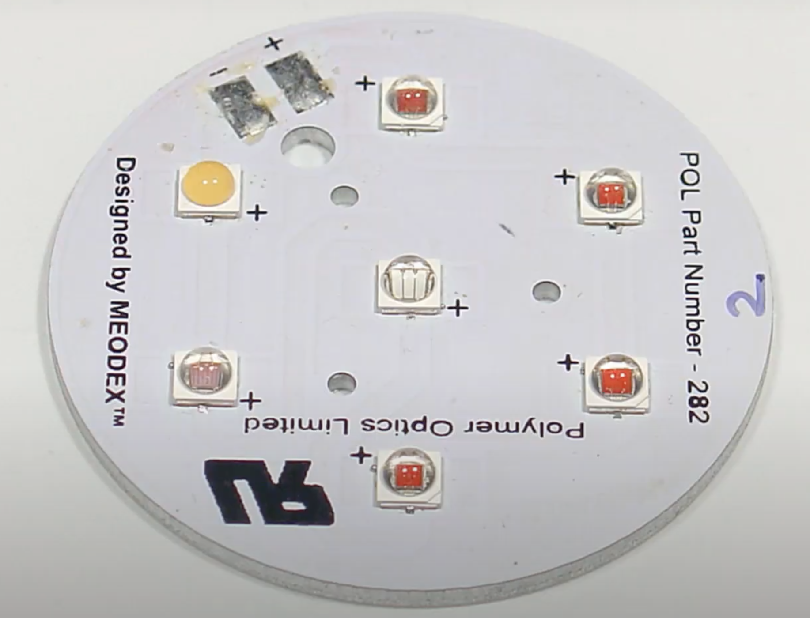
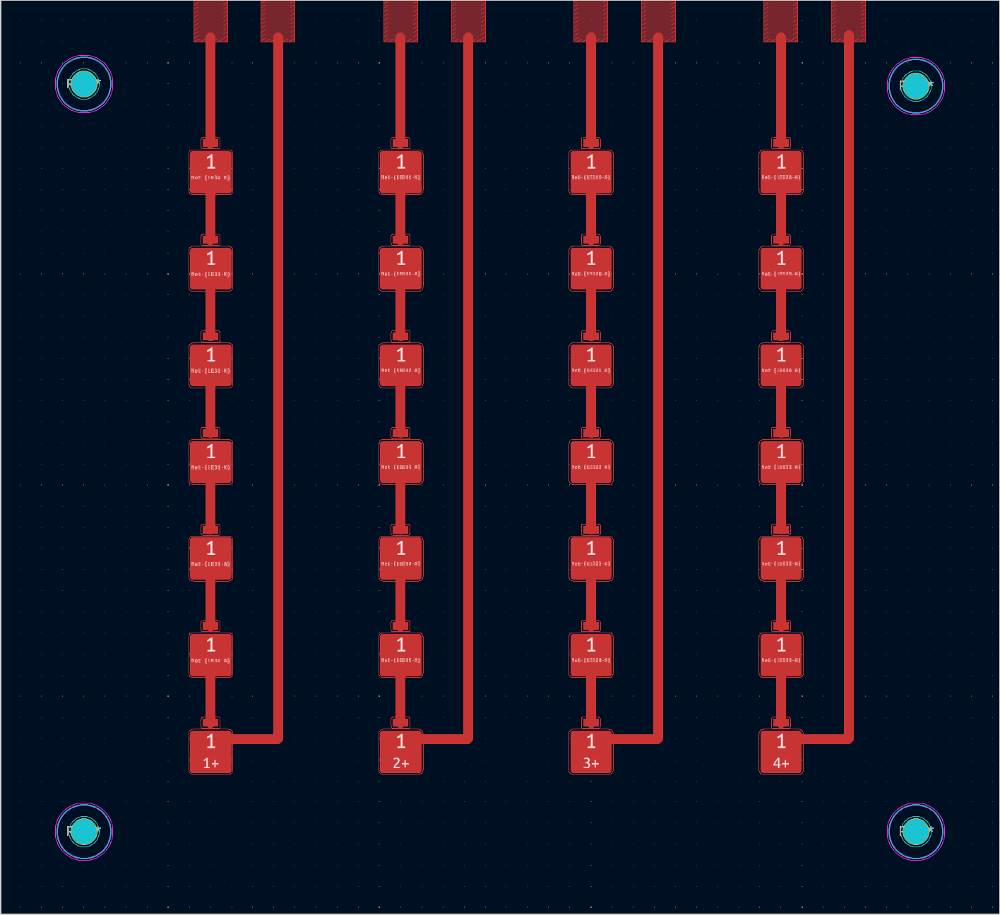
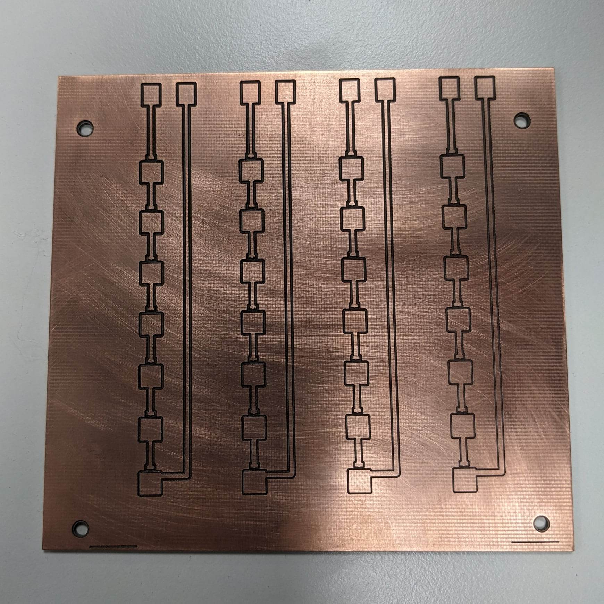
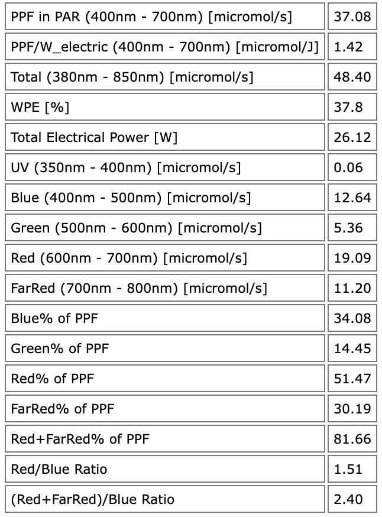
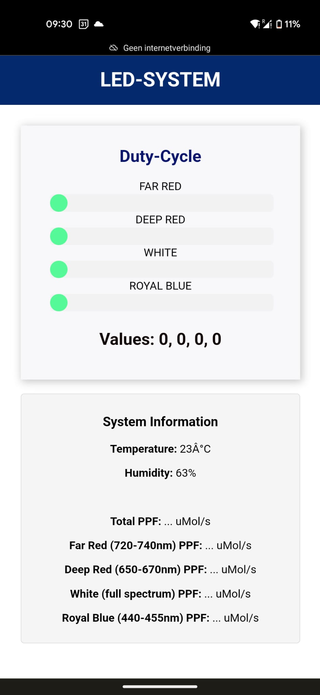
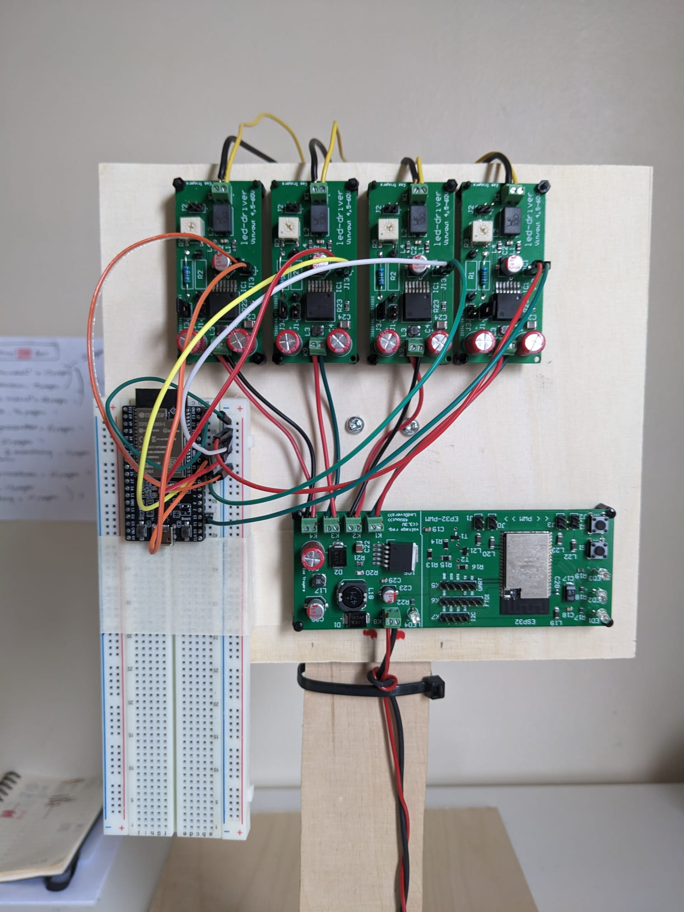
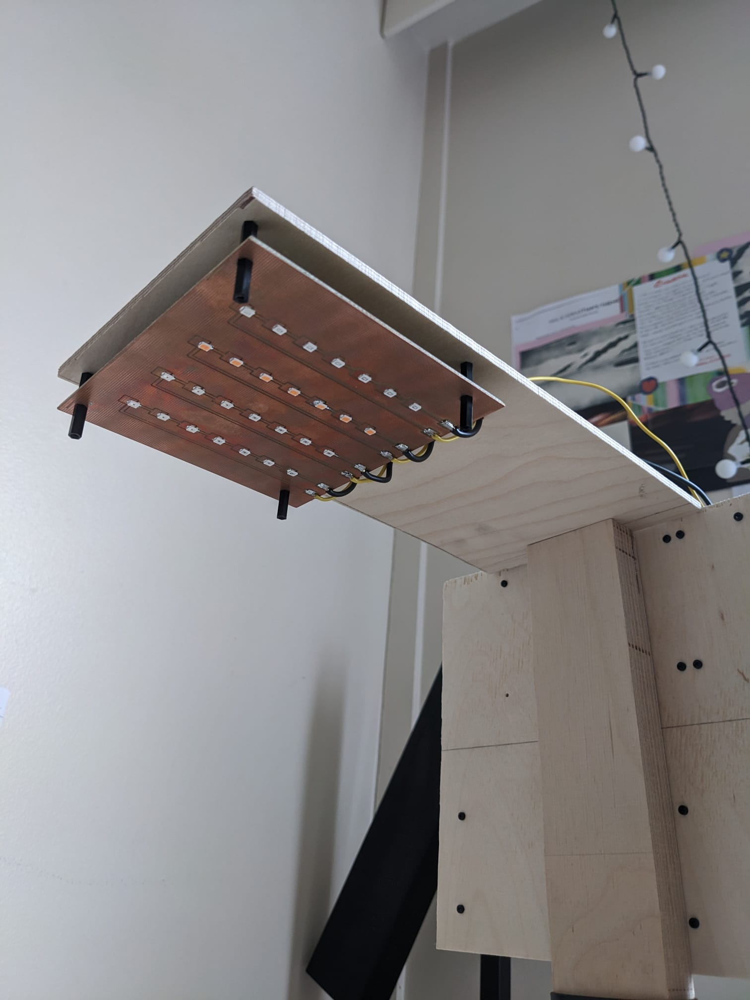
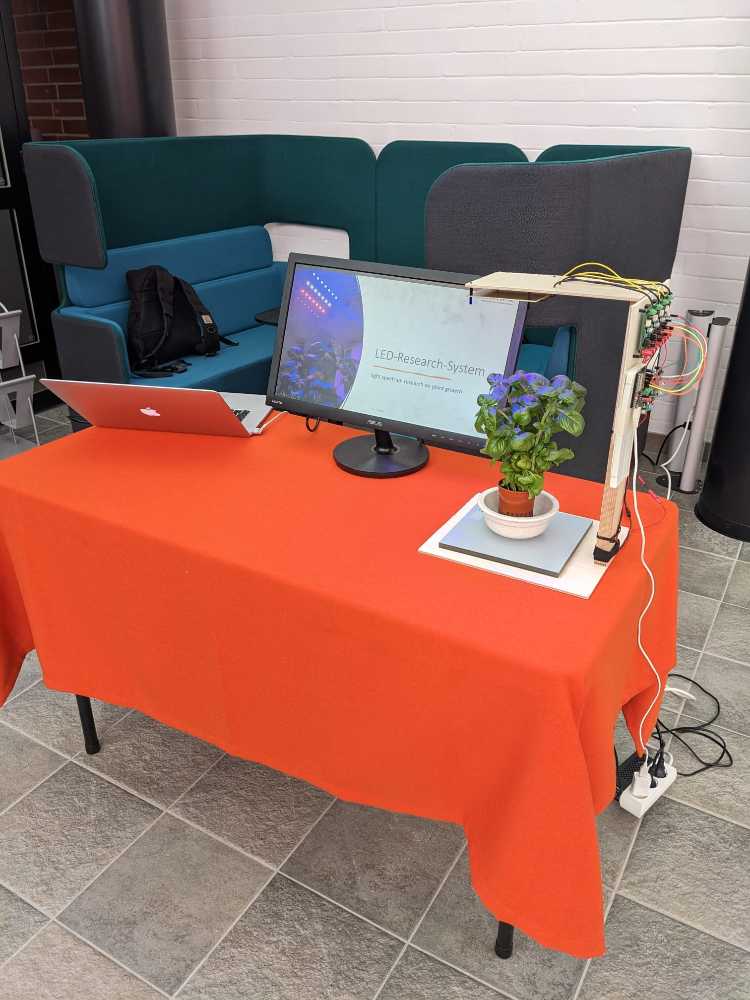

## Introduction

This weekly report serves as an overview of the progress made in the development of the LED embedded system. It provides a summary of the completed tasks, challenges encountered, and solutions developed to overcome these obstacles. 

Its purpose is to keep the promotor informed about the project’s status.

The date represents the day of adding the weeks information, usually monday or friday.

## Content table

1. [03/03/2023](#03/03/2023)
2. [10/03/2023](#10/03/2023)
3. [17/03/2023](#17/03/2023)
4. [03/04/2023](#03/04/2023)
5. [12/04/2023](#12/04/2023)
6. [18/04/2023](#18/04/2023)
7. [25/04/2023](#25/04/2023)
8. [01/05/2023](#01/05/2023)

## 03/03/2023 

The first week of the project consisted primarily of collecting documents of the hardware used. 

The ESP32, power management and LED-drivers are based are made from a previous project, based on the schematics from elector magazine. In the elector magazine and the paper I wrote a lot of documentation can be found about this hardware and specifications.

The SMD LEDS are the LUXEON SunPlus 2835 series from LumiLeds. Four different light spectrums, deep red, far red, royal blue and white.

Research has been done about how to make a suitable LED mount, but more must be done to decide on the final design.

The first idea is to build multiple small PCBs with the different LEDS mounted and then connect multiple together to create a LED light. But because the goal is to control each light spectrum individually, this design is not possible because the different LEDS are placed together. Next week I will look further in the design of the LED mount system.

  

The last thing I did this week was testing the ESP32 hardware by programming a simple LED-flash program using the arduino example for esp32.

## 10/03/2023 

Started doing research on ESP-IDF framework as alternative to arduino. As it is a framework build native by espressif exclusiv for the ESP32 MCU, it has a lot of advantages.

- Better practice/structured code in libraries to build upon.
- Documentation is more professional.
- Closer the hardware and thus more control.
- More efficient use of memory resources.

It has a steeper learning curve in the beginning, especially coming from arduino (which im not) because it follows good practice C/C++ code.

## 17/03/2023 

- Setting up programming toolchain for ESP-IDF projects
- Setting VScode as IDE with ESP-IDF extensions
- Testing the program and FreeRTOS by programming LED-BLINK task
- Writing a class (OOP) for the LEDDrivers. Basic methods for controlling the LEDDrivers are added and tested (working)

## 03/04/2023 

This week I did some more research on the LED mount, ideally I would put around 40% far red , 20% deep red, 20% blue, and 20% white. But because I only have 9 LEDs of each light spectrum and they are only 0.6W per LED, its better to use all of them. This way we can also approach the LED light better as research, mixing the total percentage completely by PWM! For later/final iterations (if there is budget and time) we can develop a more efficient LED panel designed on what the average plant and growth stage needs and thus save LEDs. (save blue and white LEDs since they will not be used that much in plant growing)

So there will be 9 LEDs of each far-red(720-740nm), deep red(650-670), royal blue(440-455) and white. This gives a total of 36 LEDs. With each led approximately 0.6W, the total wattage is 22W (If all LEDs are emitting their light spectrum, which will not be the case if used correctly). Which is not a lot, but enough to grow a lettuce for research.

## 12/04/2023 

Programming: 
With the programming environment set up, I wrote code for testing all the LED drivers together. I’m trying to program it in an object oriented style using C++. I encapsulated the LED-drivers in its own class and made methods to control them. Also general functions to call these methodes and, for example, fade in and out together to test the drivers. This was all successful. The ESP-IDF framework works on FreeRtos and you can use all the FreeRtos functionality in your code for task scheduling. Next programming step is to acces the class over a web interface. 

Hardware:
For testing the drivers I connected a typical 3.6V LED to each and set the current with a resistor value. The resistor value can be calculated with formula in the datasheet of the MagI3C module. For me it was not clear if it was working correctly for such low currents, so I played around with different values. I ended concluding that I was able to get a constant current close to the one calculated from the formula. 

LED-Research:
I was planning on making the LED PCB last week but ended up doing more research on photon output and plant growth. How much photon output do I need for growing one lettuce? How far away do I need to place the LEDs from each other on the PCB and how far from the plant to get the desired PPFD of 300umol/s/m2? I learned about the different units of measurement like PPF (Photosynthetic Photon Flux), PPFD (Photosynthetic Photon Flux Density) and DLI (Daily Light Interval) 

LED-PCB
Knowing with the new research I can make a better understanding of the LED-PCB. The purpose of the LED-PCB will be research, since it will not have a big light output and or cover area to grow a lot of plants. So knowing the units of measurements and how much each light spectrum can emit, I can make a research web page that shows live approximated data like PPF/PPFD and DLI for each led spectrum and total. I hope this week I will be able to make the LED-PCB to start growing ASAP.

## 18/04/2023 

This week I focused on making the PCB. I made final changes to the PCB design before trying to make it on the protomat S62. The next image is the LED-PCB design. The footprints had to be custom made, based on the recommendations, found in the paper published by luxeon (the LED manufacturer), extra copper is added on the cathode because that is where the most heat is being dissipated. These LEDs are specifically designed for low heat production, so this extra amount of copper can possible be enough. 4 holes are added to have mounting capabilities. 

  

Using the protomat S62 and the help of Aldo, I was able to make this PCB today.

  

Because I want to use a commercially available power source of 24V, I ended up going for 7 LEDs per light spectrum. The max voltage drop per LED is 3.3, so there is enough voltage for 7 LEDs in series. I also did final calculations on photon output and illumination area, and 7 LEDs seem to be enough for having sufficient photon output per light spectrum. (The total photon output on full power will be a lot, but because it will be for research, you want to have the possibility to grow on 80% blue and 20% Red for example, so you need high photon output per light spectrum as well for a research focused light). Next table shows the photon output for 7 LEDs per spectrum on full current.

(12 umol/s is enough for one lettuce, 20 umol/s is enough for cherry tomatoes)

  

## 25/04/2023 

This week I finished the PCB-LED. All 4 LED spectrums are soldered on the PCB and tested.

Work has also been done on the ESP32. A webserver has been set up that successfully switches on/off a button by calling a callback on the URI get request. Using the get request on URI is not a suitable solution for making the web interface because it features way to many real-time data and adjustments, JavaScript will be used instead.

This week I will focus primary on that, making the web interface. And make a small set-up for the LED-light under a plant for demonstration on 27/04 in the campus. For this the LED-Drivers also need to be adjusted for the correct current per light spectrum and soldered to the pads.

## 01/05/2023 

Working closer to the deadline for the physical presentation at the Lapland AMK on thursday 27/04, a lot of work has been done this week.

The LED PCB manufactured last week is connected for the first time to the LED Drivers to test:
- Current for each individual LED-Spectrum has been calculated/set using the external resistor solder pads on the drivers.
- Leds with fading function is being tested. Succes, all LEDs fade from 0% to 100%

Work continued on the web-interface. Websockets is being set-up instead of HTTP requests for real-time capabilities and reducing overhead:
- Using Javascript for websocket connection
- Using SPIFFS (Serial Peripheral Interface Flash File System) on the ESP32 for the HTML/CSS/JavaScript files
- Four sliders control the corresponding LEDs brightness

  

With everything working as a minimum viable product, a physical wooden construction is being created to demonstrate/start growing:
- The wooden construction has been made in the woodworking space in the university 
- PCB are connected to the wood with nylon standoffs.
- Wires are cut at the right distance and everything gets connected
- Final test, everything is working!

<table>
  <tr>
    <td></td>
    <td></td>
  </tr>
</table>

Due to shorting of pins on the onboard ESP32, I had to come up with the temperary solution of using an ESP32 from the labratory. I'm planning on maye fixing/replacing the onboard ESP32. (if there is time left)

I participated in the physical presentation of the students projects at the university on thursday 27/04. I placed basil under the lights as demonstration, (not grown under this light).

I was very suprised by the amount of people that was interested in the project, a lot of questions have been asked. I was there for four hours and almost always busy talking with other students and external visitors. A very fulfilling experience! My setup can be seen in the image below.

  

On Friday 28/04 I had a teams meeting for mid-term evaluation of the project.
